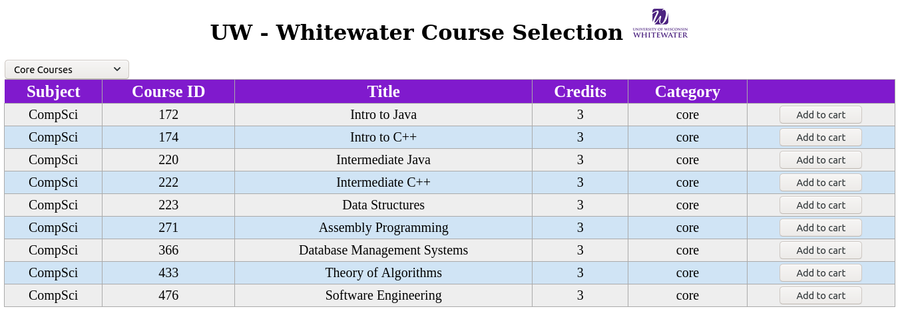
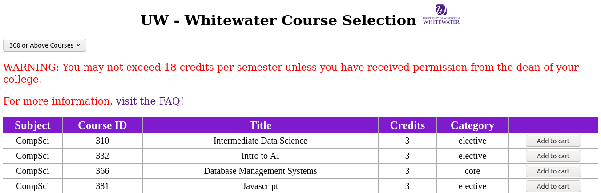

# UWW's WINS Clone
> Benzon Carlitos Salazar

## About
The [Whitewater Information Network for Students](https://www.uww.edu/aso/support/orientation/wins-overview)
(WINS) is a personal online information network that is available for refistering 
classes, checking financial records, viewing your Academic Advising Report (AAR), 
schedule, tasks, profile, grades, important dates, resources, and help.

*With the warning*

The JSON courses are embedded into the JavaScript code and are located [here](./index.js#L1)