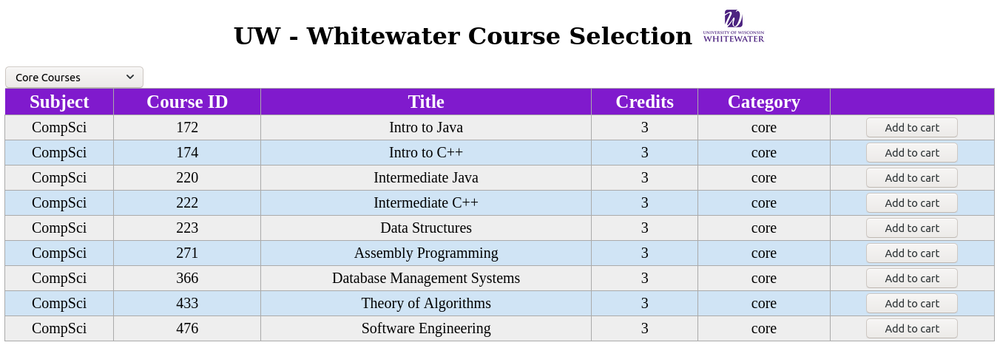
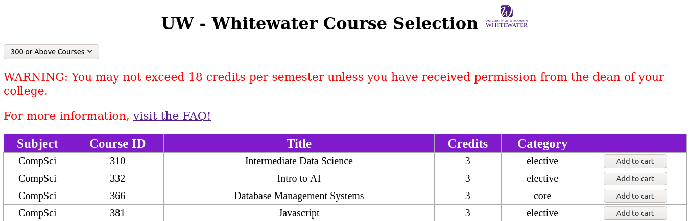

# UWW's WINS Clone
> Benzon Carlitos Salazar

## About
The [Whitewater Information Network for Students](https://www.uww.edu/aso/support/orientation/wins-overview)
(WINS) is a personal online information network that is available for refistering 
classes, checking financial records, viewing your Academic Advising Report (AAR), 
schedule, tasks, profile, grades, important dates, resources, and help.

## This implementation
The task for this implementation is simply for students to be able to add and 
remove classes, see the credits they've currently selected, and see the classes
they've currently selected based on a shopping cart implementation.

## To run:
This is a simple HTML-based project, to run:

```
$ cd WINS-clone
$ <whatever browser> index.html
```



*With the warning*


The JSON courses are embedded into the JavaScript code and are located [here](./src/index.js#L1)